# RepoGuide

[](https://github.com/laviiyy/RepoGuide/actions/workflows/ci.yml)

**Understand any repository before you run it.**

RepoGuide takes a GitHub URL, explains what the project is and what it needs, proposes an ordered
setup plan, and runs each command only after you approve it. Every command is shown before it
executes, output streams live, and a failure comes back as a specific fix instead of a wall of
stderr.

<p align="center">
  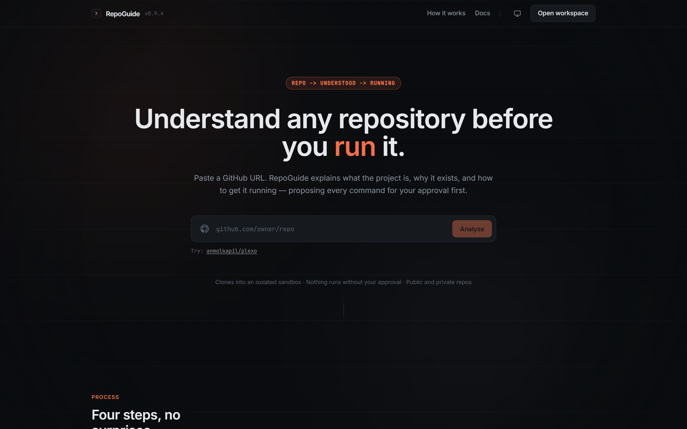
</p>

> **Status — demo with a scripted engine.** The interface is complete and runs end to end:
> routing, the session state machine, per-command approval, streaming output, error diagnosis,
> theming, motion and responsive layout. There is **no backend yet** — the engine in
> [`frontend/src/hooks/useChat.ts`](frontend/src/hooks/useChat.ts) replays scripted events with the
> same shapes a WebSocket would emit. See [Demo status](#demo-status) for exactly what is real.

## Contents

- [What it does](#what-it-does)
- [Screenshots](#screenshots)
- [Routes](#routes)
- [Features](#features)
- [Design system](#design-system)
- [Tech stack](#tech-stack)
- [Running it](#running-it)
- [Project structure](#project-structure)
- [Demo status](#demo-status)
- [Roadmap](#roadmap)
- [Regenerating the screenshots](#regenerating-the-screenshots)
- [License](#license)

## What it does

1. **Point at a repository** — paste any public GitHub URL. The repository is cloned into a
   disposable sandbox, never onto your machine.
2. **Read the intent** — RepoGuide reads the README, manifests and CI config, then explains what
   the project is, who built it and what it needs (runtime, package manager, ports, env vars).
3. **Get an ordered plan** — clone, install, migrate, run — with the reasoning for each step and
   the exact command it will execute.
4. **Approve, watch, recover** — nothing runs until you approve it. Output streams into a terminal
   block with its exit code, and when a step fails RepoGuide reads the error and proposes one
   specific fix.

## Screenshots

The landing page, in order. The directory holds the full set; the alt text describes each frame.

### Hero — the URL intake


The single most important control in the product: a 56px intake bar with a GitHub glyph, a mono
input and one accent button. It accepts a full URL, `github.com/owner/repo` or a bare `owner/repo`,
and the button stays disabled until the input parses.

### How it works — four steps, no surprises

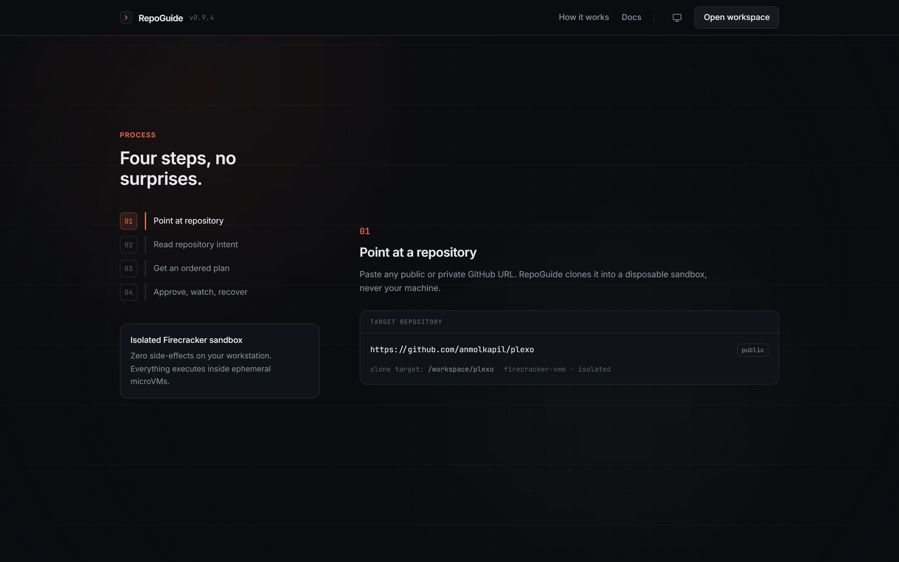

A sticky rail tracks the step you are reading. Each step carries a working artefact: the clone
target, the manifests that were read, the proposed plan, and the execution log.

### Live session preview

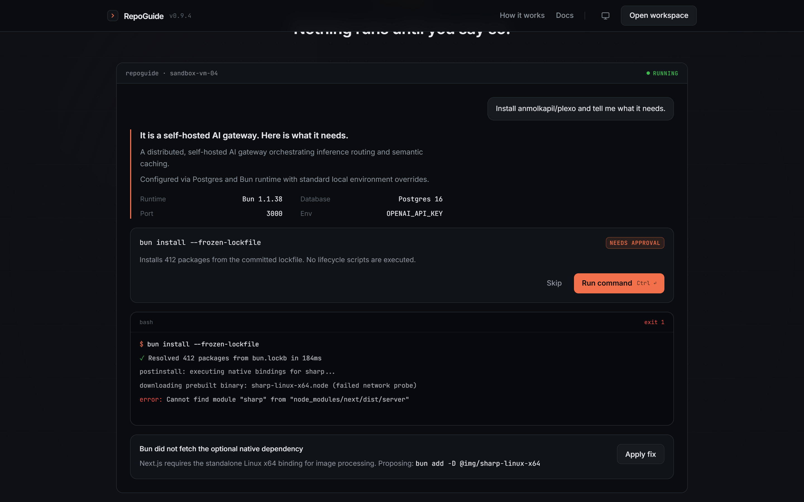

The real transcript shape — user message, intent summary, approval card, terminal output, diagnosis
strip — rendered inside the frame the workspace uses. The background glow behind this band dims to
40% so the frame reads as the focus.

### Safety and scope

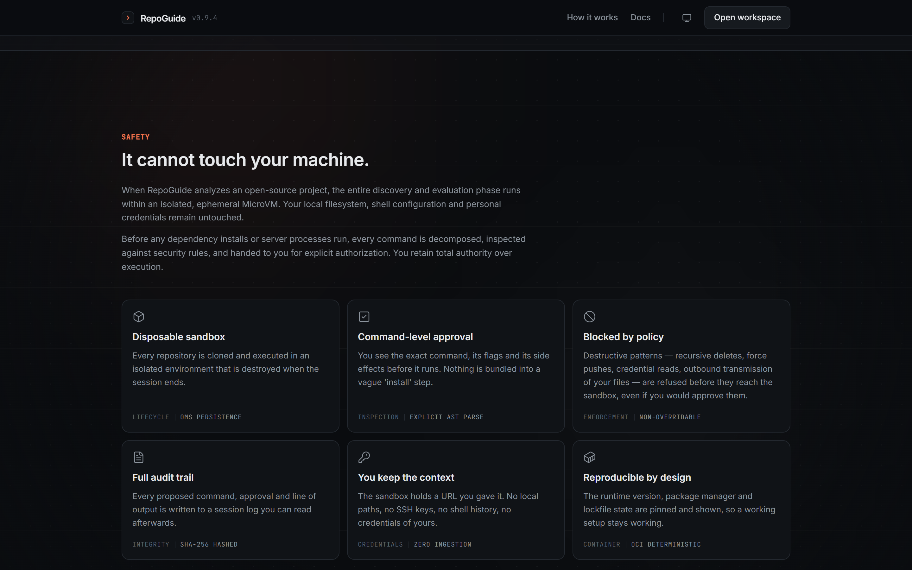

Six cards covering lifecycle, inspection, enforcement, integrity, credentials and reproducibility —
what the sandbox is allowed to do, and what it refuses to do.

### Close and handoff

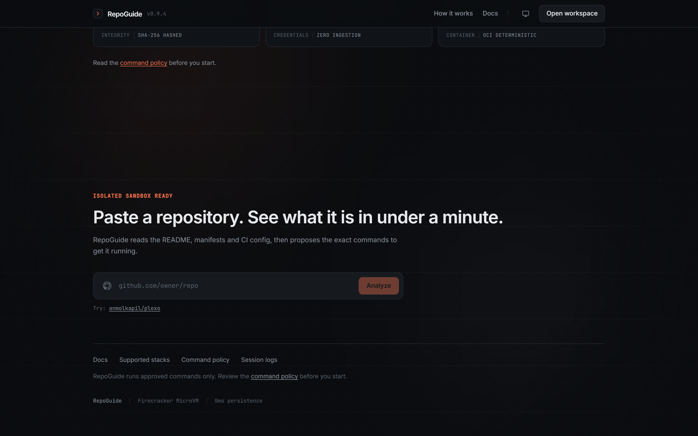

A second intake at the end of the page, plus the footer strip that links into the docs.

### The workspace

<table>
  <tr>
    <td width="50%">
      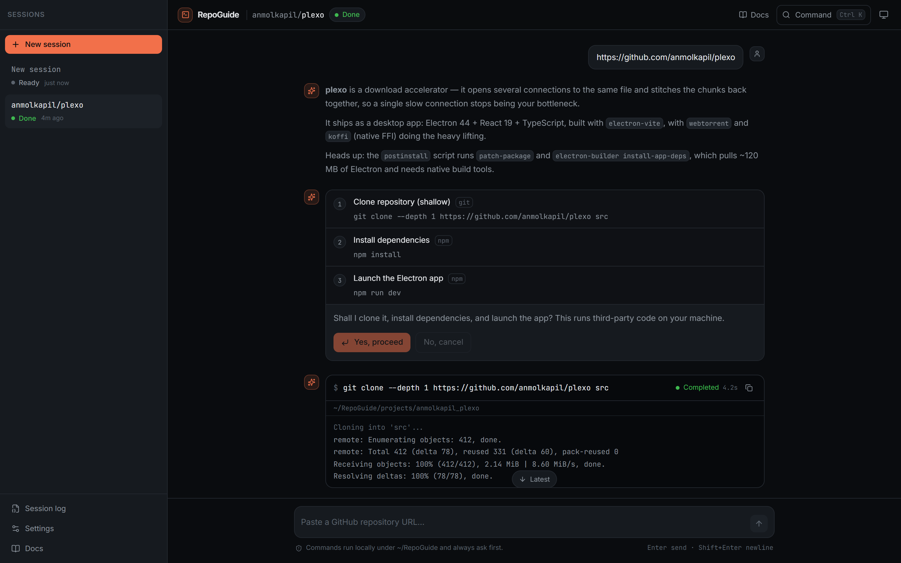
      <br><sub>Explanation, ordered plan and the approval card, with the session list behind it.</sub>
    </td>
    <td width="50%">
      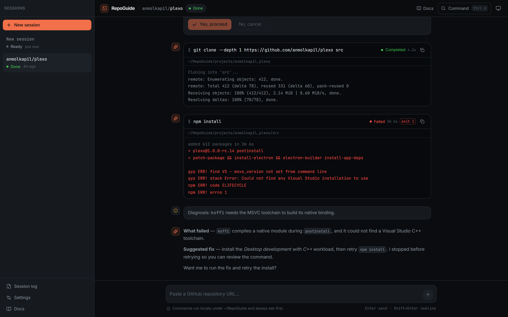
      <br><sub>Terminal output with a non-zero exit code, the diagnosis, and the suggested fix.</sub>
    </td>
  </tr>
</table>

### Docs route

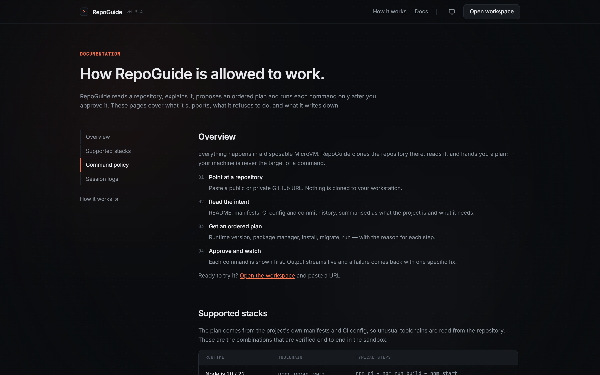

The docs are part of the app, not a separate site: Overview, Supported stacks, Command policy and
Session logs, each with its own URL.

### Light palette and the boot screen

The same components with the light token set, and the handoff that covers the first paint.

<table>
  <tr>
    <td width="50%">
      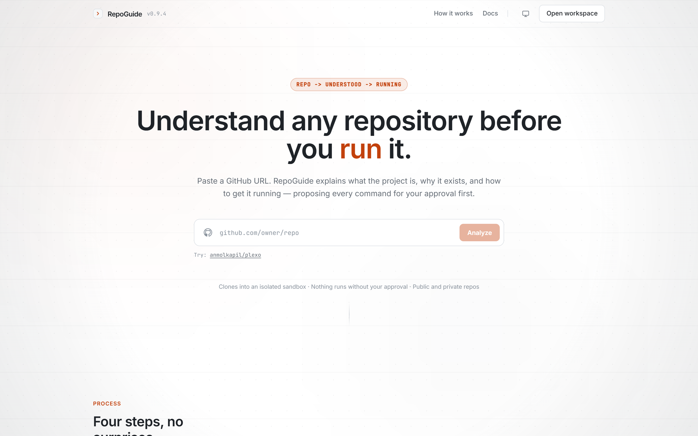
      <br><sub>Light is a token swap — same layout, same geometry.</sub>
    </td>
    <td width="50%">
      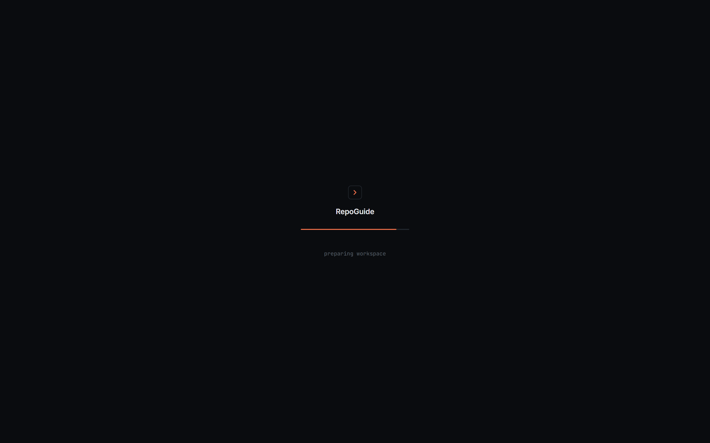
      <br><sub>The inline boot screen: a 500–900ms handoff between blank paint and the app.</sub>
    </td>
  </tr>
</table>

### Mobile

<table>
  <tr>
    <td width="50%">
      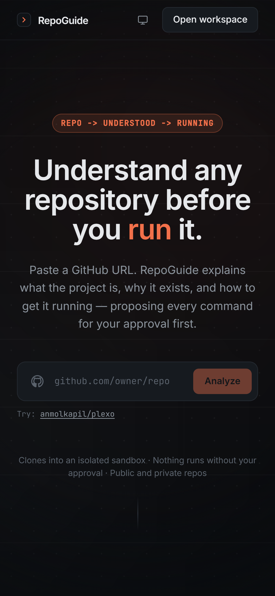
      <br><sub>Landing at 390px: navigation collapses, the hero reflows.</sub>
    </td>
    <td width="50%">
      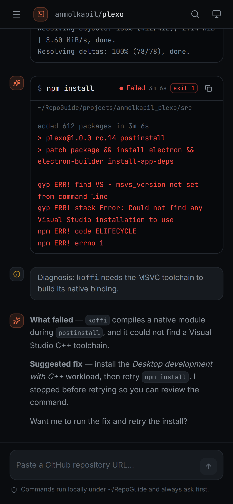
      <br><sub>Workspace at 390px: the session list becomes a drawer.</sub>
    </td>
  </tr>
</table>

## Routes

Routing is hash-based, so the bundle can be served from any static host without rewrite rules and
deep links cannot 404.

| Route | Screen | Entry point |
| --- | --- | --- |
| `#/` | Landing page (hero, process, live session, safety, close) | [`frontend/src/pages/Landing.tsx`](frontend/src/pages/Landing.tsx) |
| `#/workspace` | The workspace: session list, transcript, composer | [`frontend/src/App.tsx`](frontend/src/App.tsx) |
| `#/docs` | Documentation overview | [`frontend/src/pages/Docs.tsx`](frontend/src/pages/Docs.tsx) |
| `#/docs/stacks` | Supported runtimes and toolchains | same |
| `#/docs/policy` | Command policy — allowed and non-overridable | same |
| `#/docs/logs` | Session log format and fields | same |

Any intake on the site hands the repository to the engine and switches to `#/workspace`, so the
landing page is a real entry point rather than a static advert.

## Features

### Landing page

- **Four scroll-reactive background layers**, each an independently moving element tagged with a
  `data-depth`: a 32px dot grid (`0.05`), two soft radial glows (`0.18`) that also sweep
  left→right across the page, a 96px rule grid masked to fade at the edges (`0.35`), and a
  vignette (`1.0`) that deepens towards the closing section instead of translating, because moving
  a viewport-sized mask would expose the canvas behind it.
- **Staggered entrances** — `fade-rise(12px, 300ms)` with a 60ms step, driven by one
  `IntersectionObserver` per section so blocks cascade from a single observation point.
- **An inline boot screen** in `index.html`: a 28px bordered square with the accent caret, the
  wordmark, a 220×2px track and the mono label `preparing workspace`. It paints before the bundle
  arrives and is dismissed on the app's first painted frame, with a 4s safety net.
- Sections: hero with the URL intake, the four-step process with a sticky rail that tracks the
  active step, the live session frame, the safety grid, and the close section with a second intake.

### Workspace

- Session sidebar with live status per session (`Ready`, `Needs approval`, `Running`, `Done`,
  `Failed`) and a drawer on small screens.
- Transcript rendering every message kind: markdown explanations, ordered plans with a per-step
  tool label, terminal blocks with `cwd`, exit code and duration, notices, and streamed text with a
  blinking caret.
- Per-command approval: approve, reject, or cancel mid-run. Nothing executes without a decision.
- Command palette on <kbd>⌘K</kbd> / <kbd>Ctrl K</kbd> for sessions, theme, dialogs and navigation.
- Composer with cancel-while-running, and a "scroll to latest" affordance when output arrives while
  you are reading history.

### Theming and accessibility

- Dark is canonical (`#0A0C0F` canvas, `#F2704A` accent); light is a token swap. The stored choice
  is applied by an inline script before first paint, so there is no flash of the wrong palette.
- Every interactive element has a visible `2px` accent focus ring, icon-only buttons carry
  `aria-label`s, and status is conveyed by text as well as colour.
- `prefers-reduced-motion` turns every entrance, parallax layer and caret blink into an instant
  state change.

## Design system

One accent, hairline borders, flat panes, and JetBrains Mono reserved for text a machine produced.

| Token | Dark (canonical) | Light |
| --- | --- | --- |
| `canvas` | `#0A0C0F` | `#FFFFFF` |
| `surface` | `#101317` | `#F6F7F8` |
| `surface-raised` | `#161A1F` | `#FFFFFF` |
| `surface-hover` | `#1C2127` | `#EEF0F2` |
| `border` / `border-strong` | `#23282F` / `#313842` | `#DDE1E6` / `#C6CBD1` |
| `text` / `text-muted` / `text-faint` | `#E6E8EB` / `#8B939C` / `#5B636D` | `#1F2328` / `#656D76` / `#8C959F` |
| `accent` | `#F2704A` | `#C2410C` |
| `success` / `warning` / `danger` | `#3FB950` / `#D29922` / `#F85149` | `#1A7F37` / `#9A6700` / `#CF222E` |
| `terminal` | `#07090C` | `#0A0C0F` (terminals stay dark) |

Geometry: 6px for chips and keys, 8px for buttons and inputs, 12px for cards and terminals, 16px
for modals. Type: Inter for interface text, JetBrains Mono only for repositories, paths, commands,
versions, ports and exit codes, with `tabular-nums` on every number.

Motion vocabulary, as specified and implemented: `scroll-progress`, `parallax(depth)`,
`stagger(60ms)`, `fade-rise(12px, 300ms)`, `settle(200ms)` — mechanical and quiet, no bounce, no
rotate, everything with a reduced-motion equivalent.

The system was designed in [Stitch](https://stitch.withgoogle.com) before any code was written: a
screen brief, a design system (dark canonical, one accent, ROUND_EIGHT) and seven exported screens,
which the components in this repository follow one for one. Those design artefacts — the brief and
the exported frames — are kept in a local `.stitch/` folder and are not tracked here.

## Tech stack

| Layer | Choice |
| --- | --- |
| Framework | React 19 + TypeScript, function components only |
| Build | Vite 8 |
| Styling | Tailwind v4 with `@theme` tokens, CSS variables for the palettes |
| State | Zustand (single store, no context tree) |
| Content | `react-markdown` + `remark-gfm` for explanations |
| Icons | `lucide-react` (inline SVG, `stroke-width: 1.5`) |
| Lint / types | `oxlint` with the React plugin, and `tsc -b` running before `vite build` so type errors fail the build |
| Motion | CSS keyframes plus a `requestAnimationFrame`-throttled scroll hook — no animation library at runtime |

## Running it

The app is a standalone package in [`frontend/`](frontend):

```bash
cd frontend
npm install
npm run dev          # dev server with HMR, http://localhost:5173
```

```bash
npm run build        # tsc -b && vite build  ->  frontend/dist
npm run preview      # serve the production build
npm run lint         # oxlint
npx tsc -b           # type check only
```

Requirements: Node 20 or newer (developed on Node 24) and npm. The demo needs no environment
variables, no API keys and no backend — it runs entirely in the browser, offline.

Every push and pull request runs the same four steps in CI — `npm ci`, typecheck, lint and
build — via [`.github/workflows/ci.yml`](.github/workflows/ci.yml).

## Project structure

```
RepoGuide/
├── frontend/                      # the app (own package)
│   ├── index.html                 # boot screen + theme script are inline here
│   ├── src/
│   │   ├── pages/                 # Landing.tsx, Docs.tsx — the routed screens
│   │   ├── components/            # landing sections, workspace, shared UI
│   │   ├── hooks/                 # useChat (engine), useRoute, useScroll, useInView, useTheme
│   │   ├── store/                 # zustand session store
│   │   ├── lib/utils.ts           # cn, time, GitHub URL parsing
│   │   └── index.css              # design tokens, layers, motion helpers
│   └── dist/                      # build output (git-ignored)
├── docs/screenshots/              # images used by this README
├── tools/capture-screenshots.mjs  # regenerates them from a running app
└── main.py                        # reserved for the planned FastAPI service (empty)
```

Design artefacts (`.stitch/`) and local tooling folders (`.opencode/`, `.freebuff/`) are
git-ignored and deliberately not part of this repository.

## Demo status

**Real:** routing and history, the session state machine and every UI state it can produce,
per-command approval and cancellation, terminal rendering with exit codes, error diagnosis, theming,
the boot handoff, the four background layers, the docs route, responsive layout down to 390px, and a
clean production build.

**Scripted:** the engine itself. [`useChat.ts`](frontend/src/hooks/useChat.ts) replays a fixed
transcript — the analysis text and the plan do not change with the repository you paste — and nothing
is cloned or executed. Owners and repository names are interpolated from your input, which makes the
gap easy to spot: type a repository RepoGuide does not "know" and it still answers about a
download accelerator.

**Not implemented:** the sandbox, the command-policy enforcement and the hashed session logs that
the landing page and the docs describe. Those pages specify the intended architecture; treat them as
the specification for the backend rather than as shipping guarantees.

Sessions live in memory only, so a reload resets the session list, and there are no automated tests
yet — the routes, the run handoff and the scroll behaviour were verified by driving a browser, not by
a suite.

## Roadmap

1. **Engine contract.** `useChat.ts` already names the events a backend has to emit
   (`assistant_text`, `plan`, `step_start`, `stdout`, `stderr`, `done`) on `/ws/{session_id}`.
   Implementing that in FastAPI — reuse analysis, real clone, real command execution — is the step
   that turns the demo into the product.
2. **A repo-aware simulator** in the meantime: a handful of known repositories with plausible
   analyses, and an honest response for anything unknown instead of canned copy.
3. **Session persistence** so reloads keep history.
4. **Tests** — a route and interaction smoke suite, plus the scroll and boot behaviours.
5. **Mobile hardening** — dynamic viewport units and safe-area padding for real phone browsers.
6. **TypeScript strict mode** — the tsconfigs currently omit `strict`; turning it on and paying the
   type debt is the kind of cleanup this codebase can now afford.
7. **Deploy** — the static build is ready for any host; hash routing needs no rewrites.

## Regenerating the screenshots

The images above are captured from the running app by
[`tools/capture-screenshots.mjs`](tools/capture-screenshots.mjs), which drives a headless Chromium
over the DevTools protocol — no dependencies to install:

```bash
cd frontend && npm run dev          # serve the app
node tools/capture-screenshots.mjs  # writes docs/screenshots/*.png
```

Set `APP_URL` if the dev server is not on `http://127.0.0.1:5173`, and `CHROME_PATH` if Chromium is
not in the default Windows location.

## License

Copyright © 2026 **Sparsh Dehran**. All rights reserved.

This repository is published for viewing and evaluation. It is **not** open source: no permission is
granted to copy, reuse, modify or redistribute the code, the interface design, the documentation or
the screenshots, in whole or in part. Third-party dependencies keep their own licences.

Read the full terms in [LICENSE](LICENSE); permission requests go through
[@laviiyy](https://github.com/laviiyy).

## Credits

Built by **Sparsh Dehran** — [@laviiyy](https://github.com/laviiyy). The interface was designed in
Stitch before implementation: screen brief and design system first, then the components you see in
the screenshots above.

© 2026 Sparsh Dehran. All rights reserved.
